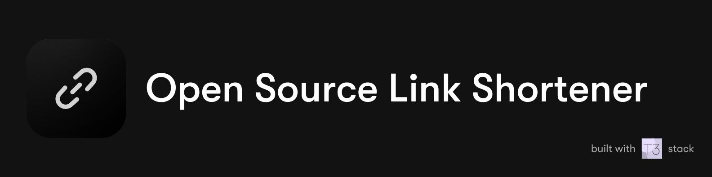

<div align="center">

<a href="https://slug-link-shorten.vercel.app/">

</a>

</div>

## 📦 Stack used 

- ✅ **Bootstrapping**: [create-t3-app](https://create.t3.gg).
- ✅ **Framework**: [Nextjs 13 + Typescript](https://nextjs.org/).
- ✅ **Auth**: [Next-Auth.js](https://next-auth.js.org)
- ✅ **ORM**: [Prisma](https://prisma.io).
- ✅ **Database**: [MongoDB](https://www.mongodb.com/).
- ✅ **Styling**: [TailwindCSS](https://tailwindcss.com) + [Shadcn-ui](https://ui.shadcn.com/).
- ✅ **Typescript Schema Validation**: [Zod](https://github.com/colinhacks/zod).
- ✅ **End-to-end typesafe API**: [tRPC](https://trpc.io/).
- ✅ **Data fetching**: [Tanstack Query](https://tanstack.com/query/latest).
- ✅ **Animation**: [Framer motion](https://www.framer.com/motion/).


## 🚀 Getting Started 

1. Fork this project:

- [Click here](https://github.com/kurumeii/slug-link-shorten/fork).

2. Install dependencies:

```bash
npm install
# or
pnpm install
# or
yarn install
```

3. Create a **.env** file with the structure in the file **.env.example**


4. Run the cmd

```bash
# Push your DB to mongodb:
npx prisma db push

# Run the project:
npm run dev

# (Optional) Run Prisma Studio to see your DB data:
npx prisma studio
```

## 🎉 Deploy on Vercel

✅ https://slug-link-shorten.vercel.app/
